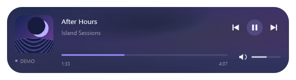
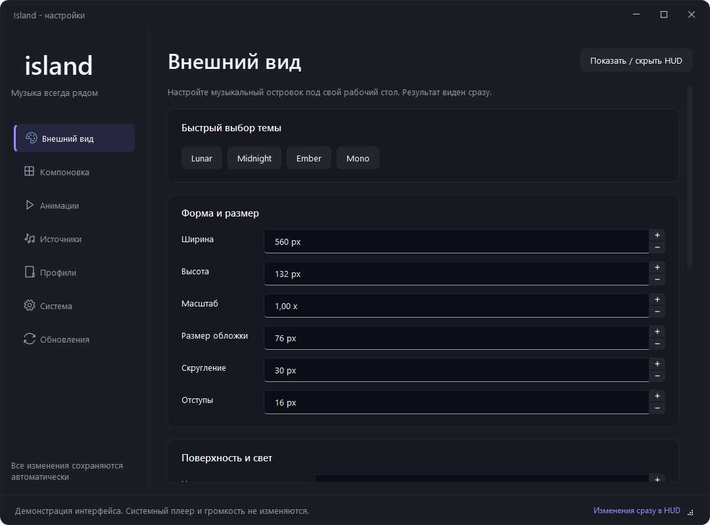
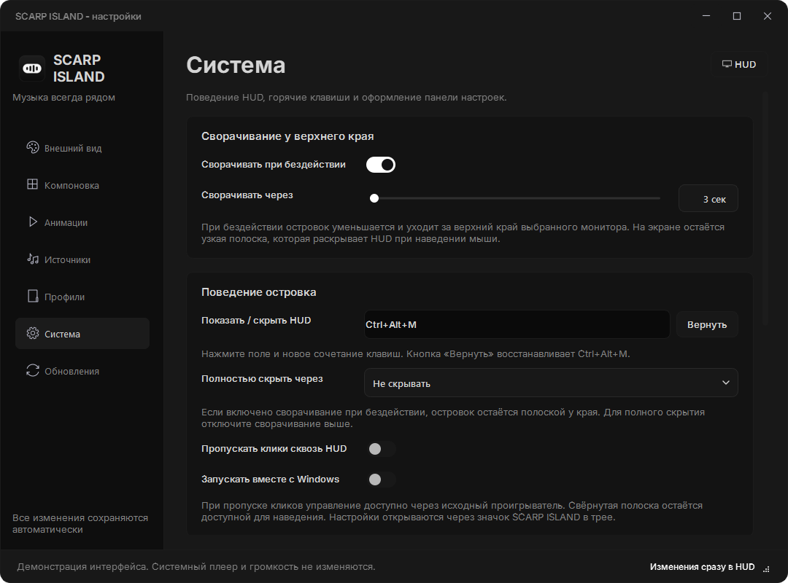

<div align="center">


# SCARP ISLAND

**Музыка всегда рядом.**

Компактный музыкальный островок для Windows. Нативный C++, прозрачный фон и настройки под ваш рабочий стол.

[](https://github.com/scarrymany/Island/releases/latest)
[](https://github.com/scarrymany/Island/actions/workflows/build.yml)


[](LICENSE)

[Скачать](https://github.com/scarrymany/Island/releases/latest) · [Возможности](#возможности) · [Сборка](#сборка) · [Сообщить об ошибке](https://github.com/scarrymany/Island/issues)



</div>



Снимки сделаны собранным Windows-приложением версии 1.1.0 в изолированном демонстрационном режиме. Музыка и обложка демонстрационные; это настоящие виджеты приложения, не макеты. Прозрачность, края и наведение дополнительно проверены на Windows-композиторе в CI.

## Новое в 1.1.1

Добавлены 55 встроенных шрифтов с русской и украинской кириллицей (всего 61), плавнее работает быстрое переключение страниц настроек, а HUD меньше перерисовывается при отсутствии отображаемого времени и прогресса. Исправлено форматирование чрезмерно большой длительности медиазаписи. [Подробности выпуска](docs/releases/v1.1.1.md).

## Новое в 1.1.0

- **Пять пресетов**: Lunar, Compact, Focus, Studio и Terminal. У каждого есть описание и мини-превью; применение меняет только оформление и компоновку.
- **Шесть встроенных шрифтов с кириллицей**: Inter, Manrope, Golos Text, Rubik, IBM Plex Sans и JetBrains Mono. Устанавливать их в Windows не нужно.
- **Закрепление и возврат позиции**: отключите перемещение окна, сохранив кнопки плеера, или верните островок наверх по центру выбранного экрана.
- **Восстановление после автоскрытия**: продолжение того же трека и новые данные во время затухания снова показывают островок; ручное скрытие сохраняется.
- **Сглаженные скругления** без жёсткого обрезания контура Windows-маской.
- **Читаемый список изменений** при первом запуске новой версии, с повторным открытием в «Обновлениях» и трее.

[Подробности выпуска](docs/releases/v1.1.0.md) · [Закрепление и возврат](docs/screenshots/position.png) · [Окно изменений](docs/screenshots/whats-new.png). Настройки, профили, пользовательские темы и адрес обновлений совместимы с 1.0.6.

## Возможности

| Музыка | Оформление | Поведение |
| --- | --- | --- |
| Spotify, SoundCloud и другие системные медиасессии | Размеры, масштаб, обложка и скругления | Поверх обычных и безрамочных окон |
| Название, исполнитель, альбом и источник | Размытая обложка в фоне, прозрачность и цвета | Трей и защита от двойного запуска |
| Обложка, позиция, длительность и Play/Pause | Шрифты, значки, отступы и прогресс | Горячая клавиша и автоскрытие |
| Предыдущий трек, пауза, следующий и перемотка | Скрытие каждого элемента, Drag & Drop | Несколько мониторов и отдельные позиции |
| Автовыбор и ручной выбор источника | Темы Lunar, Midnight, Ember, Mono | Автозапуск с Windows по желанию |
| Громкость текущего приложения | Свои темы, профили, импорт и экспорт JSON | Обновления через GitHub Releases |

Текст HUD использует Inter SemiBold с более жирным заголовком трека. Шрифт, размер и насыщенность можно изменить.

После 3 секунд бездействия островок уменьшается и уходит за верхний край выбранного монитора. Остаётся полоска высотой 8 px. Наведите мышь, чтобы раскрыть её. Задержка, размеры, видимая часть, скругление, фон и прозрачность компактного вида настраиваются отдельно. Переключение треков не раскрывает свёрнутый островок.

Настройки применяются сразу. У появления, исчезновения, сворачивания, обложки, названия, прогресса, наведения и Play/Pause отдельные переключатели анимации и общая настройка длительности. Внешнее свечение отсутствует; контур по умолчанию выключен, его толщину, цвет и прозрачность можно задать вручную.

Фон окрашивается размытой обложкой текущего трека и плавно меняется вместе с ней. Светлые обложки затемняются для читаемости текста. Выраженность эффекта настраивается; его можно отключить, оставив выбранный цвет и градиент. При отсутствии обложки используется обычный фон.

Настройки используют графитовую палитру SCARP, Inter SemiBold, плавные переходы страниц, перемещение подсветки бокового меню и переключатели. Длительность и анимации панели задаются отдельно от HUD. Размеры и прозрачность меняются ползунками с точным вводом значения; таймер скрытия предлагает готовые интервалы и свой вариант.

Выпадающие списки плавно появляются и закрываются, подстраиваются под край экрана и сохраняют ширину поля. Названия шрифтов отображаются единым читаемым шрифтом. Доступны управление мышью, поиск по первым буквам, стрелки, Enter и отмена через Esc. Анимации списков отключаются вместе с остальными эффектами настроек.



## Установка

На [странице релизов](https://github.com/scarrymany/Island/releases/latest) доступны:

- **Island-Setup.exe** - установщик с ярлыком в меню «Пуск» и удалением через параметры Windows.
- **Island-win-x64.zip** - переносимая версия. Распакуйте всю папку и запустите `Island.exe`.
- **SHA256SUMS** - контрольные суммы файлов.

Название продукта - SCARP ISLAND. Имена файлов, каталог настроек и адрес обновлений сохранены для совместимости с предыдущими версиями.

В разделе «Обновления» кнопка GitHub открывает публичную страницу проекта. Проверка использует официальный репозиторий; её автоматический запуск можно отключить.

Нужна Windows 10 1809 или новее, x64. Qt и библиотеки C++ включены в дистрибутив. Python, .NET и аккаунт Spotify API для запуска не нужны.

Шрифт настроек Inter и ещё 60 семейств с поддержкой кириллицы встроены в приложение и работают в переносимой версии без установки в Windows. Все встроенные семейства распространяются по SIL OFL 1.1; лицензии и источники указаны в [THIRD_PARTY_NOTICES.md](THIRD_PARTY_NOTICES.md).

## Управление

1. Запустите SCARP ISLAND и включите музыку в приложении или браузере.
2. Выберите оформление и монитор в настройках.
3. Перетащите островок за свободную область. В «Компоновке» можно закрепить его или вернуть наверх по центру текущего монитора. Для перемещения отдельных элементов включите режим редактирования в разделе «Компоновка».

`Ctrl+Alt+M` раскрывает свёрнутый островок, а раскрытый показывает или скрывает. Сочетание можно изменить и восстановить кнопкой «Вернуть» в разделе «Система». Правая кнопка на островке открывает меню, колесо над громкостью меняет громкость текущего приложения. Полосу прогресса можно нажать или перетащить с зажатой ЛКМ, если источник разрешает перемотку. При перетаскивании отображается выбранное время; отпускание применяет позицию. Во время перетаскивания и редактирования компоновки островок остаётся раскрытым.

Закрытие настроек оставляет SCARP ISLAND в трее. Нажмите значок трея для открытия настроек, среднюю кнопку - для переключения HUD. Повторный запуск открывает существующий экземпляр. Полный выход находится в меню трея.

## Совместимость

- Источник должен публиковать Windows Media Session. Для SoundCloud это обычно вкладка поддерживающего Media Session браузера. Альбом, длительность, обложку и доступность кнопок определяет сам источник.
- Громкость управляет аудиосессиями текущего приложения в микшере Windows. Для YouTube и SoundCloud это громкость всего браузера, включая другие его вкладки. Общая громкость устройства не меняется. Если источник нельзя сопоставить со звуковой сессией, ползунок недоступен.
- HUD работает поверх оконных и безрамочных игр. Эксклюзивный полноэкранный режим и защищённые системные экраны могут перекрывать обычное окно. Внедрения в игры и обхода античита нет.
- Размытие рисуется отдельным визуальным слоем Windows Composition и ограничивается скруглённой формой. На Windows 11 используется Host Backdrop; для Windows 10 предусмотрен необязательный системный механизм. Если система не предоставляет размытие, остаётся прозрачный фон. Внешние поля и углы окна сохраняют прозрачность.
- При ручном выборе исчезнувшего источника SCARP ISLAND ждёт его возвращения. Для переключения между плеерами выберите автоматический режим.
- Анимации и плавный прогресс обновляются с учётом частоты выбранного монитора, включая экраны с высокой герцовкой. При смене монитора частота пересчитывается. В скрытом и полностью свёрнутом состоянии постоянная отрисовка останавливается; размытие обложки подготавливается только при её изменении.

## Профили и данные

Настройки: `%LOCALAPPDATA%\Island\config.json`. Запись атомарная; некорректный файл сохраняется отдельно для восстановления. Профиль - сохранённый снимок текущего оформления и поведения. После изменения настроек сохраните профиль ещё раз, если хотите обновить снимок.

Отметка о прочтении списка изменений хранится отдельно в `release-state.json` рядом с настройками, поэтому переключение профилей и импорт не показывают его повторно.

Экспорт включает настройки, профили и пользовательские темы. Импорт проверяет типы, диапазоны, цвета и версию формата до применения.

SCARP ISLAND не отправляет историю прослушивания. При включённой проверке обновлений выполняется HTTPS-запрос к GitHub. Обновление устанавливается по кнопке после проверки размера и SHA-256 из метаданных релиза.

## Сборка

Требуются Visual Studio 2022 Build Tools с C++, Windows SDK 10.0.26100 или новее, CMake 3.25+, Qt 6.8.3 для MSVC 2022 x64. Компоненты Visual Studio перечислены в [.vsconfig](.vsconfig).

```powershell
.\scripts\build.ps1 -QtPath 'C:\Qt\6.8.3\msvc2022_64'
```

Скрипт собирает Release, запускает QtTest и готовит `dist\Island\Island.exe`. Для установщика добавьте `-Package`; потребуется NSIS 3.03+ в PATH. Порядок публикации описан в [RELEASING.md](docs/RELEASING.md).

```powershell
.\dist\Island\Island.exe --demo
.\dist\Island\Island.exe --background
.\dist\Island\Island.exe --quit
.\dist\Island\Island.exe --demo --smoke-test --capture .\artifacts
```

`--demo` использует изолированные настройки и нарисованную обложку, не управляет системной музыкой и громкостью. `--smoke-test --diagnostics .\artifacts\media.json` проверяет реальные медиасессии и завершает приложение. Диагностика может содержать название текущего трека; проверяйте её перед публикацией.

## Устройство проекта

`MediaBridge` получает снимки состояния через C++/WinRT в отдельном потоке. `HudWindow` рисует островок, `SettingsWindow` изменяет настройки через `ConfigStore`. `SessionVolume` управляет громкостью аудиосессий выбранного источника в отдельном потоке. `WindowsIntegration` отвечает за горячие клавиши и системные эффекты. `UpdateService` проверяет и скачивает релизы.

Новый источник можно подключить через контракт `MediaSnapshot` и команды плеера, сохранив HUD и настройки.

Настройки оформлены в стиле SCARP. Компактная подача музыки вдохновлена [MusicUI](https://github.com/But3rflys/umbrella-work/tree/main/scripts/musicui). Реализация самостоятельная.

Код SCARP ISLAND распространяется по [MIT](LICENSE). Лицензии компонентов указаны в [THIRD_PARTY_NOTICES.md](THIRD_PARTY_NOTICES.md).
